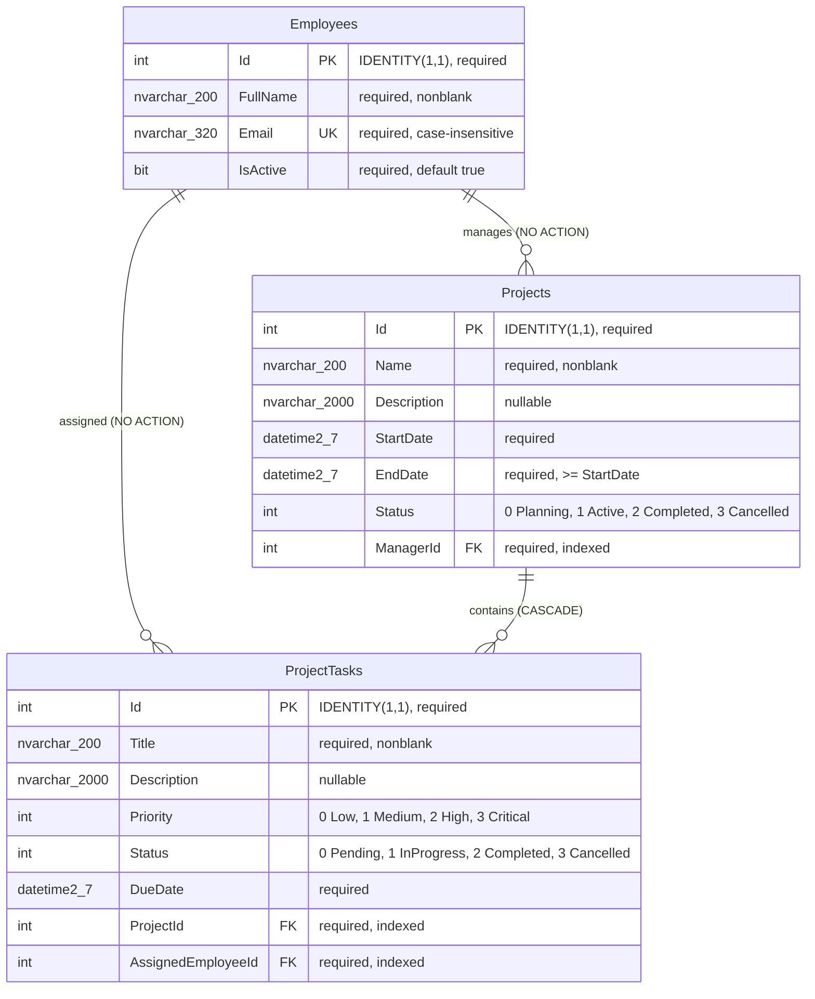

# Database ERD

All primary keys are generated integer identities. A project has exactly one employee manager; a task has exactly one project and one employee assignee. Employees/projects may have zero dependents. The unique email index and all three foreign-key indexes are generated by the initial migration. Eight check constraints cover required nonblank text (four), enum ranges (three), and ordered project dates (one). EF migration metadata is stored separately in `__EFMigrationsHistory`; it is not a business entity.
